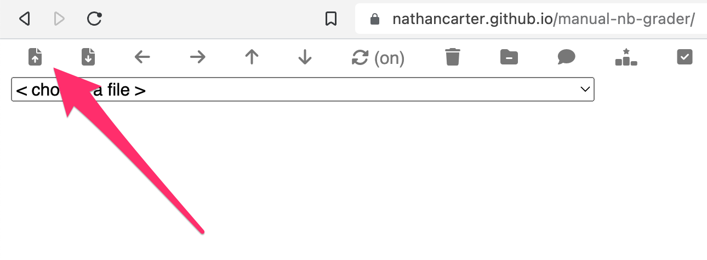
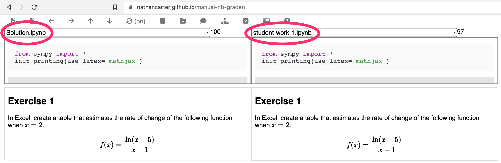
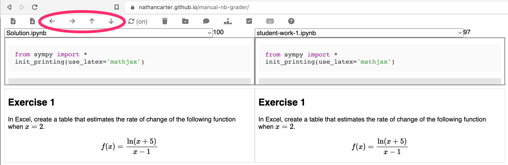
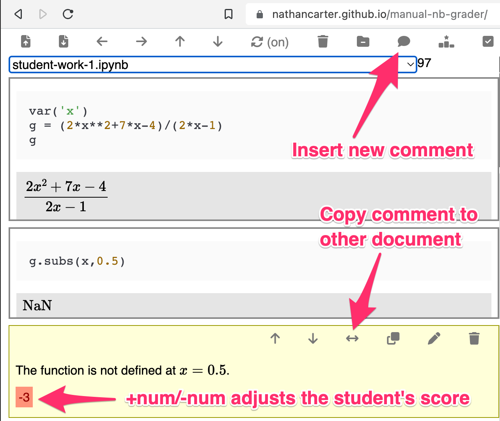
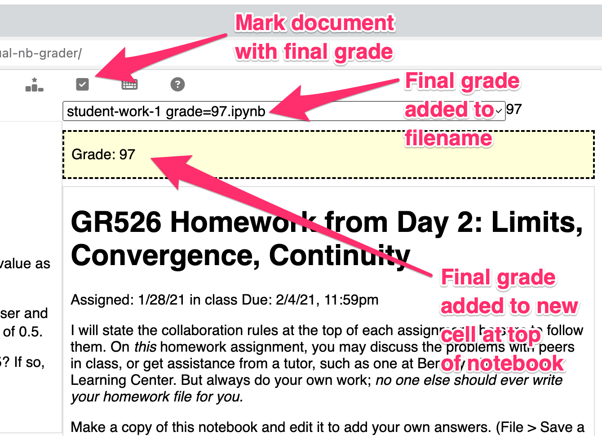

# Manual Notebook Grader

## Why do we need this?

After all, there's already the impressive project
[`nbgrader`](https://nbgrader.readthedocs.io/en/stable/)
that enables instructors to automatically and/or manually grade student work.

 1. `nbgrader` aims to make a certain set of workflows smooth; this tool is
    designed to make a different set of workflows smooth.  You may prefer one
    tool or the other depending on your workflow.  (See below.)
 1. `nbgrader` requires a very specific setup and configuration of assignments,
    which is best done through Jupyter itself (not a cloud provider, f.ex.),
    and not every instructor can or wants to obey that constraint.

## Intended use

I assume you have a collection of notebooks (`.ipynb` files), probably all in
the same folder (but not necessarily), most of them student work, and probably
also one (or more) of them the instructor's solution.  It is also beneficial if
both the solution and the student work are organized under the same headings
(that is, Markdown cells with `# Headings` in them), but this is not a strict
requirement.  You then do this:

 * [Visit this app online.](http://nathancarter.github.io/manual-nb-grader)
 * Click the upload button and upload your files.  (This does not actually
   put them on a server in the cloud; it just puts them in your browser's own
   storage.  I never see your files.)

 * Pick the solution file from one dropdown list and a student's work in the
   other.

 * If you like to grade all of one student's work before moving to other students:
    * Use Page up/down to navigate them in sync, matching the headings as you move
      through the documents.
    * There are also toolbar buttons if you prefer them to keyboard shortcuts.
 * If you like to grade all of problem 1 for all students, then all of problem 2,
   etc.:
    * Use Cmd+Page up/down to navigate among student files, skill keeping the
      same heading in view in each.
    * There are also toolbar buttons if you prefer them to keyboard shortcuts.

 * Click the comment button to add feedback for the student in Markdown.  Use a
   line with just a number on it (e.g., `+5` or `-3.5`) to alter the student's
   score.
 * To be consistent across students, you can copy any comment cell into your
   solutions document, and use it as a library of common feedback.

 * When a file is complete, click the toolbar button to store a grade in a cell
   at the top, and alter the filename to include the grade as well.
 * After grading all files, click the download button to get them back onto your
   hard drive, for sharing with students.

## License

MIT License
